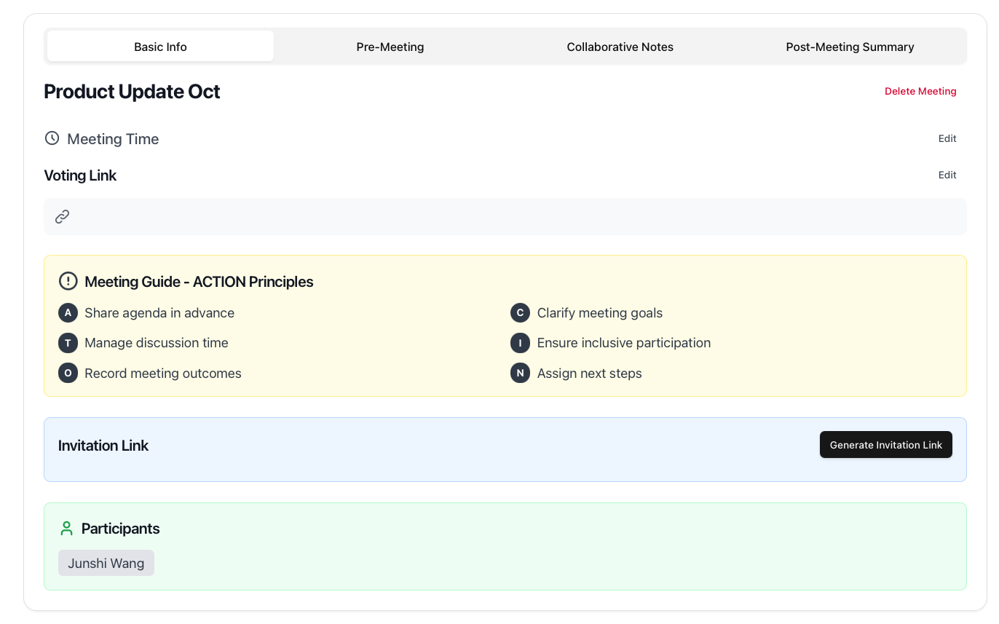
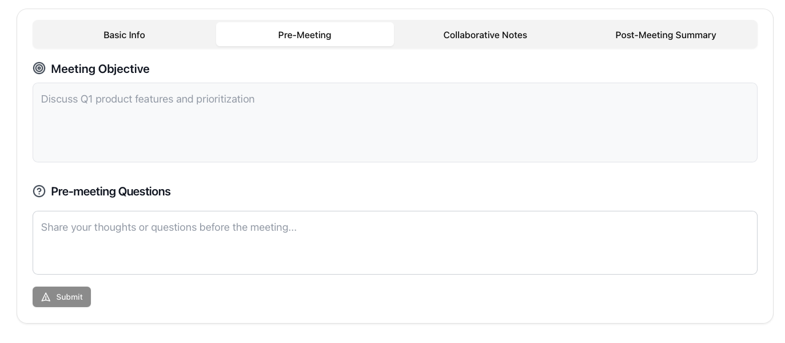
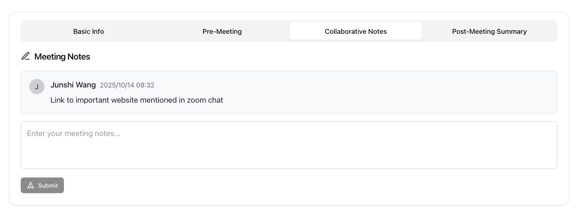
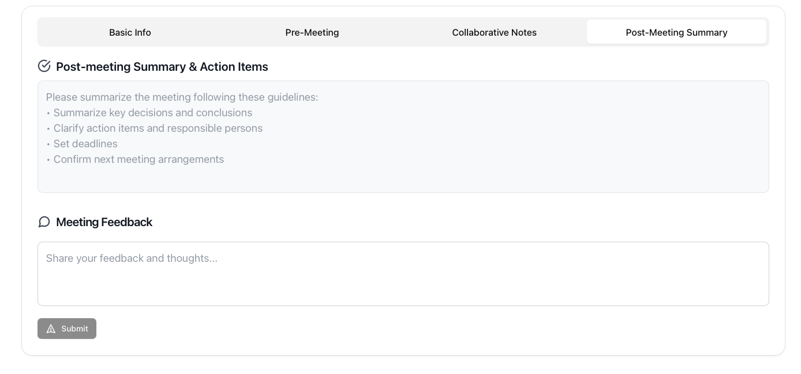

# 🧠 Teamie — Smarter, Easier, Faster Meetings

**Teamie** is an all-in-one meeting assistant designed for student teams.  
From pre-meeting preparation to real-time collaboration and post-meeting summaries, Teamie helps you make meetings **fast**, **accurate**, and **effortless**.

> ⚡️“Run better meetings — without the chaos.”



---

## ✨ Features

### 🕒 Before the Meeting
- Create agendas and assign roles in seconds  
- Automatically send calendar invites  
- Collect materials from all team members  


### 💬 During the Meeting
- Real-time collaborative notes  
- AI-powered topic tracking and time reminders  
- Clear task and decision recording  


### ✅ After the Meeting
- Auto-generate and share meeting summaries  
- Sync tasks with your favorite apps  
- Review past meetings for better decisions  


---

## 💡 Why Teamie
- **Fast:** Set up meetings in under a minute  
- **Accurate:** Keep discussions structured and clear  
- **Effortless:** Let AI handle the messy parts  


---

## 🚀 Tech Stack
- **Frontend:** React + Tailwind CSS  
- **Backend:** Node.js + Express  
- **Database:** PostgreSQL  
- **AI Assistant:** OpenAI GPT-5 API  

---

## 🧩 Installation

```bash
# Clone the repository
git clone https://github.com/yourusername/teamie.git

# Enter the project directory
cd teamie

# Install dependencies
npm install

# Run the app
npm start
```

---

## 🤝 Contributing

We welcome contributions from developers, designers, and product thinkers!
If you’d like to help improve Teamie:
-- Fork this repo
-- Create a new branch (feature/your-feature-name)
-- Submit a pull request

---

📄 License

This project is licensed under the MIT License — see the LICENSE file for details.